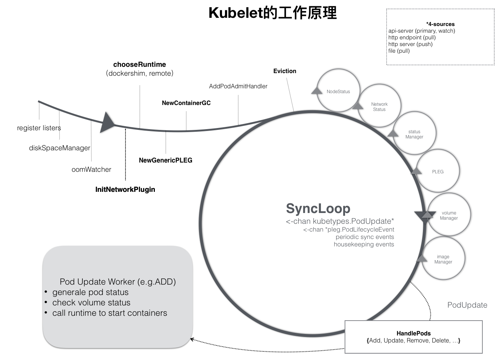

## CRI

### Kubelet组件
1. kubelet工作原理图
2. kubelet 工作原理
  * kubelet 内部组件结构图
  * Kubelet API，包括 10250 端口的认证 API、4194 端口的 cAdvisor API、10255 端口的只读 API 以及 10248 端口的健康检查 API
  * syncLoop：从 API 或者 manifest 目录接收 Pod 更新，发送到 podWorkers 处理，大量使用 channel 处理来处理异步请求
    辅助的 manager，如 cAdvisor、PLEG、Volume Manager 等，处理 syncLoop 以外的其他工作
  * CRI：容器执行引擎接口，负责与 container runtime shim 通信
  * 容器执行引擎，如 dockershim、rkt 等（注：rkt 暂未完成 CRI 的迁移）
  * 网络插件，目前支持 CNI 和 kubenet
  
### CRI容器运行时接口
1. CRI示意图

### Pod 启动流程
1. pod启动

### 参考资料
* [SIG-Node与CRI](https://time.geekbang.org/column/article/71056#previewimg)
* [kubernetes-handbook kubelet](https://feisky.xyz/kubernetes-handbook/components/kubelet.html)