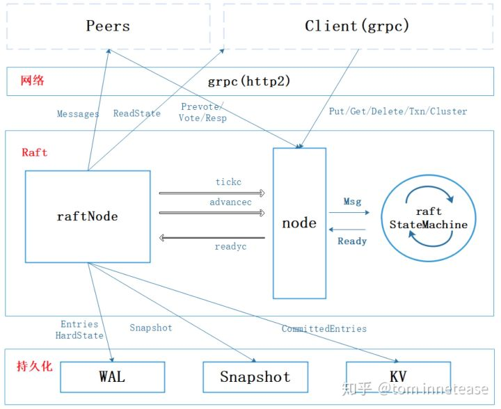

## Etcd
##### Etcd架构图

##### 参考资料
* [etcd raft设计与实现](https://zhuanlan.zhihu.com/p/51063866)
* [深入浅出etcd](https://mp.weixin.qq.com/s?__biz=MzIzNzU5NTYzMA==&mid=2247485663&idx=1&sn=99b7b003cd9fd083115752fc238839f4&chksm=e8c7765edfb0ff48a350b453a6ad5998082d4c2e7e0fad0d29f20654bb9cb6a7930fdea75388&pass_ticket=prKTSyOEHKW8DR5gjZtbRnXZaJxEr0S%2FOJvr%2BQt4QS3VAuZQs2H6O%2B7WHInGAO9y#rd)
* [高可用分布式存储 etcd 的实现原理
](https://draveness.me/etcd-introduction?from=singlemessage&isappinstalled=0)
* [Etcd存储的实现](https://www.codedump.info/post/20181125-etcd-server/)